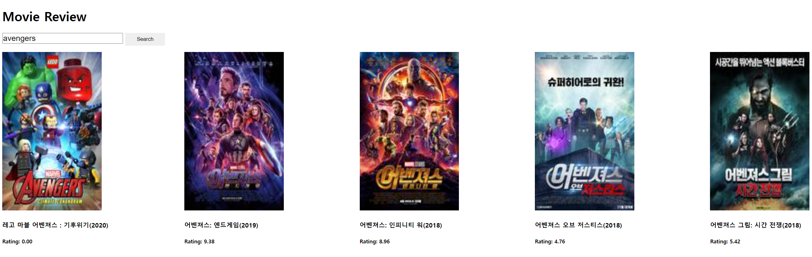
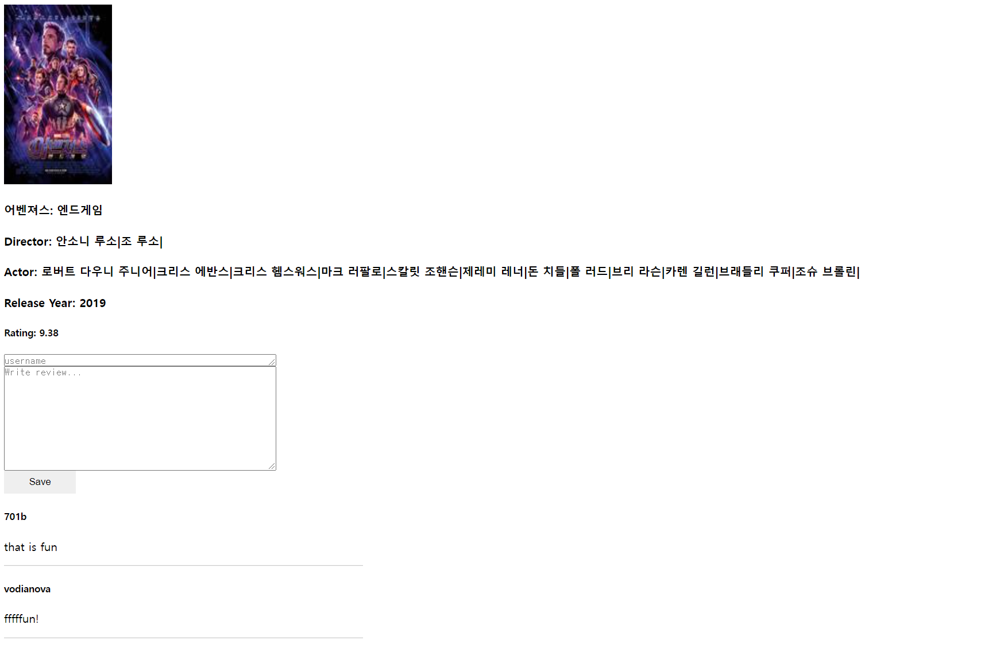

# MovieReviewWeb

## Instruction
MovieReviewWeb is a web app that provides the function to search for movies and write reviews for movies.  

On the first screen, you need to enter a movie title.


If you search for 'avengers', you will see the following screenshot.



You can click on one of these to view the movie's details and reviews like foolwing screenshot.



Information such as posters and movie titles are fetched by using the Naver search API.

Reviews are stored and retrieved by using a firebase realtime database.

## Demo

[](https://www.youtube.com/embed/kCnEfXOkq-E)

Click on the image to go to YouTube.

## How to run

First, you should download the project.

Then, you should install the npm package by using following command.

```
npm install
```

You can run the server by using following command.

```
npm start
```

Now launch your browser and type ```localhost:3000``` in the address bar.